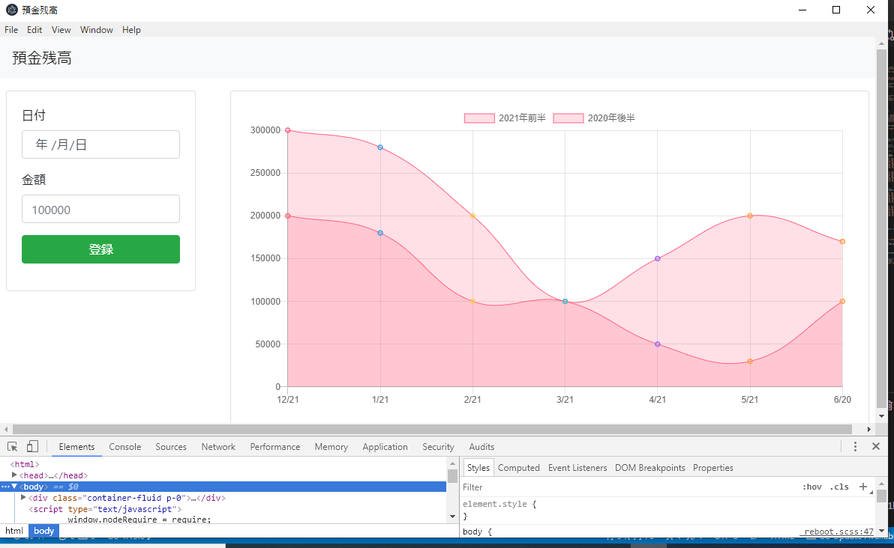

# Golang学習用プロジェクト

## 目的

* Golangアプリ開発の全体像把握
* レガシーデスクトップアプリの代替になるか調査

## 開発対象

* Go学習用サンプルプログラム
* gotronを用いたデスクトップアプリ

## 開発環境

* Windows 10
* VSC 1.52.1
* Go 1.15.6
* Git 2.27.0.windows.1

## 構築手順

### Go

1. [ここ](https://golang.org/dl/)のインストーラをダウンロード
2. インストーラ実行（全部デフォルトで良い）
3. コマンドプロンプト起動
4. 以下のコマンドでGoのversionが表示すれば良い

    ```sh
    > go version
    ```

5. インストーラが`%GOPATH`にGoのパスを設定する

### VCS

#### プラグイン

1. `Go`で検索して、`golang.go`のプラグインをインストール
2. コマンドパレット(Ctrl+Shift+P)を開く
3. `GO: Install/Update tools`で検索
4. 全ツールを選択し、OKボタンを押下してインストール
5. delveをインストール
   * VCSの「実行とデバッグ」ボタンを押すとインストールされる

#### プロジェクト作成

* 任意の場所にフォルダ作成してVCSで開く

### Go Modules

* パッケージ管理ライブラリ
* <https://qiita.com/yokoto/items/13be66b6276e17d9f554>

  ```sh
  > cd ${プロジェクト名}
  > go mod init ${プロジェクト名}
  ```

* go.modファイルができる

### パッケージ取得

* godocはjavadocみたいなもの

1. godocをダウンロードする

    ```sh
    > go get golang.org/x/tools/cmd/godoc
    ```

2. godocの使い方例

    ```sh
    > go doc fmt
    ```

### SQLite

* GoでSqliteを扱うには以下の準備が必要
* <https://www.sqlite.org/download.html>
  * sqlite-tools-win32-x86-3340100.zip
  * PATH通す
* <https://jmeubank.github.io/tdm-gcc/>
  * tdm-gcc-webdl.exe
* go get github.com/mattn/go-sqlite3

### gotron

* Electronベースのデスクトップアプリ
* 以下の準備が必要
* node.js(npm)をインストール

## ドキュメント

### VCSのプラグイン

* <https://code.visualstudio.com/docs/languages/go>

### パッケージ

* <https://golang.org/pkg/>

## 操作

### 実行

```sh
> go run ${Goファイル}
```

### コード整形

```sh
> gofmt ${Goファイル} // 整形の提案表示
> gofmt -w ${Goファイル} // 整形の提案通り反映
```

### テスト

* Goはテスト対象のGoファイルと同列にテストファイルを作成する文化
* lib/math.goの単体テストは、lib/math_test.goとして作成する
* `testing`をimportしてテスト用ライブラリを利用する
* その他のテスティングフレームワークには、Ginkgo、Gomegaがある

```sh
> go test -v ./...
```

* -v : 実行結果表示
* ./... : カレントディレクトリ以下全てからテストを探して実行する

### ビルド

```sh
> go build ${Goファイル}
```

### ローカルドキュメント

* 基本javadocのように記載する
  * lib/math.go参照
* godocのexamplesは、テストファイルで`Example関数名`で関数作るとそれが例になる
  * lib/math_test.goのExampleAverageとExamplePerson_Say参照

```sh
> godoc -http=localhost:6060
```

* <http://localhost:6060>でgodocを閲覧する

## プロジェクト構成

* Goの一般的な構成に合わせてる

* assets
  * 実行時に必要なリソースファイルを配置
  * 今回でいうとsqliteのファイル
* cmd
  * main.goを配置
  * 実行する機能ごとフォルダを分けて管理
  * 今回作成した機能に関しては後述
  
  ```sh
  > go run cmd/deposit_chart/main.go
  ```

* config
  * 設定ファイルを配置
* internal
  * 自作内部ライブラリを配置
* scripts
  * buildやdeployなどがインフラに関するスクリプト
* web
  * html、js、cssなど配置

## Go学習用サンプルプログラム

* cmd/study以下の各main.go

### define

* 基本構文、slice、map、関数

### statement

* for、range
* switch
* defer

### pointer

* ポインタ

### struct

* 構造体
* interface

### goroutine/lib

* groutine
* channel

### package

* パッケージの参照方法

### database

* sqlite

### third-party

* semaphore
* 設定ファイル

### network

* http
* JSON

### web

* Webアプリケーション

## gotronを用いたデスクトップアプリ

* cmd/deposit_chart/main.go
* web以下にhtmlなど

### 仕様

* 預金残高の管理
* 残高推移を表すグラフを表示

### ライブラリ

* gotron
  * <https://github.com/Equanox/gotron>
  * websocket
    * cmd/deposit_chart/main.go#L36-48
* jQuery
  * <http://tk2-207-13211.vs.sakura.ne.jp/2016/02/749/>
  * <https://noitalog.tokyo/electron-jquery/#toc2>
    * web/index.html#L44-47
* i18next
  * <https://www.i18next.com/overview/getting-started>
  * 国際化対応
  * web/js以下にライブラリ
  * web/localesにメッセージファイル
* koazee
  * <https://github.com/wesovilabs/koazee>
  * sliceやmapに対して、JavaのStreamのような操作ができる
  * 戻り値がrelrectなので一癖あり
    * cmd/deposit_chart/main.go#L56-59
* guregu/null
  * <https://qiita.com/isao_e_dev/items/55a9ad66f00ef031ac6c>
  * 基本Goはnullセーフだけど、JSON作成時にnullが必要のため使用
  * cmd/deposit_chart/main.go#L78
* sliceやmapは定数化できない
  * https://qvault.io/2019/10/21/golang-constant-maps-slices/

### 画面イメージ



### 操作

#### ローカル実行

```sh
> go run cmd/deposit_chart/main.go
```

#### リリースビルド

```sh
> scripts/gotron-builder
```

* dist/win-unpacked内にexeとjsができる。exeを実行すると起動する